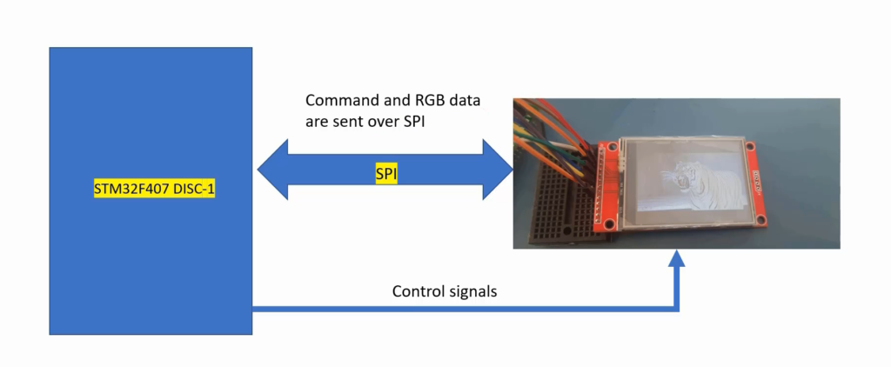
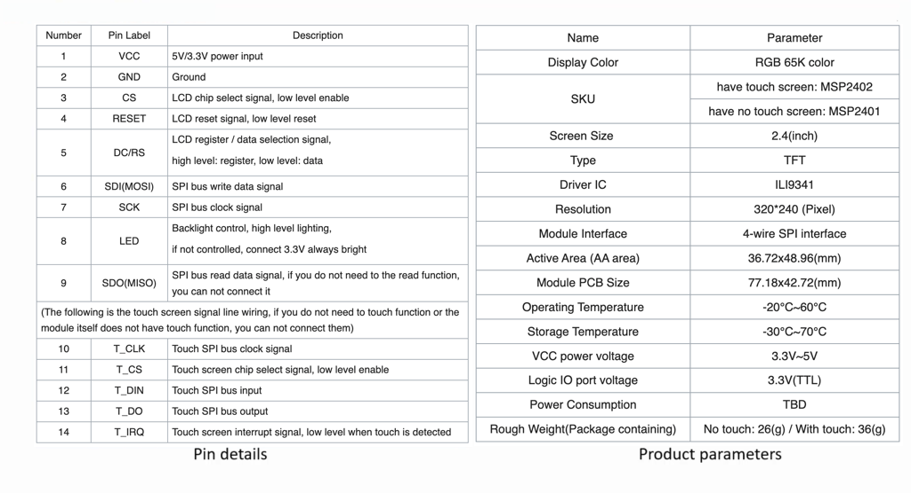
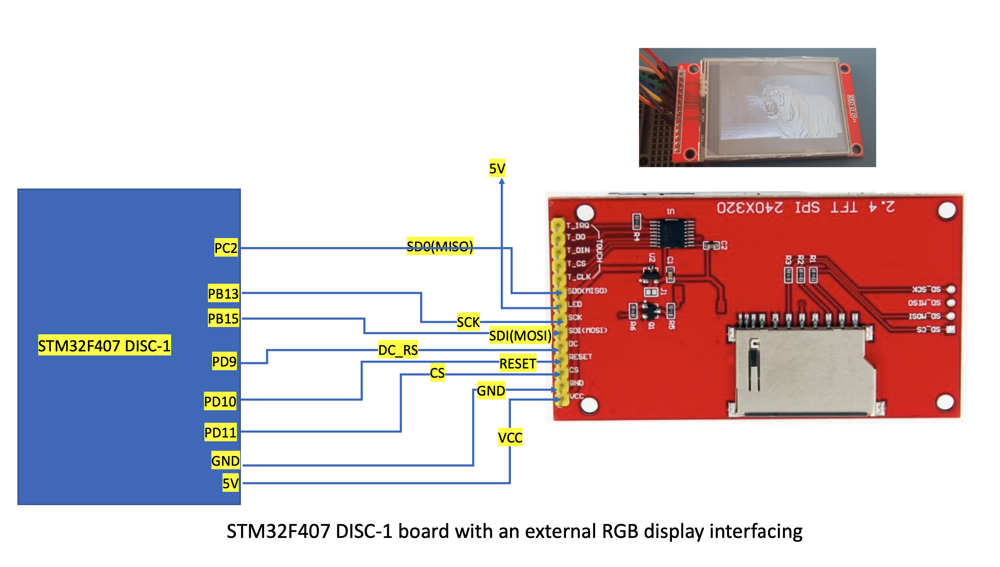

## Roaring tiger demo on STM32F407-DISC board with external LCD
      
			
Here we are using SPI communication along with a few control signals. And the SPI communication is used to send commands, its parameters, and the RGB data   
    
		 
       
       
Our LCD-TFT display module is based on **ILI9341** chip
         
	              
										 			 
													 
Download [Datasheet](http://www.lcdwiki.com/res/MSP2402/ILI9341_Datasheet.pdf), [User Manual](http://www.lcdwiki.com/res/MSP2402/2.4inch_SPI_Module_MSP2402_User_Manual_EN.pdf), and [Schematic](http://www.lcdwiki.com/res/MSP2402/MSP2402-2.4-SPI.pdf) of `ILI9341 chip`													 
        
				
### Connection details     
       
				      
				 				   

