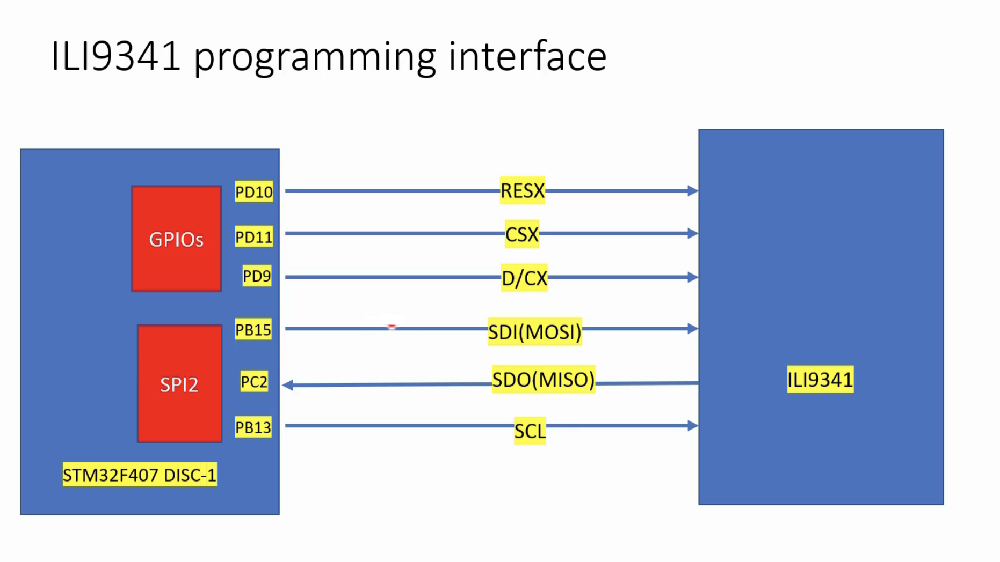
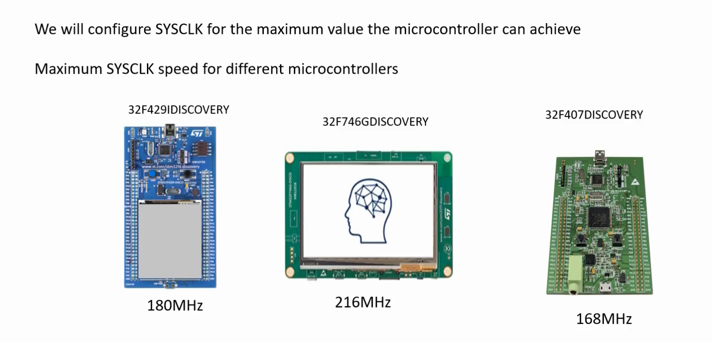
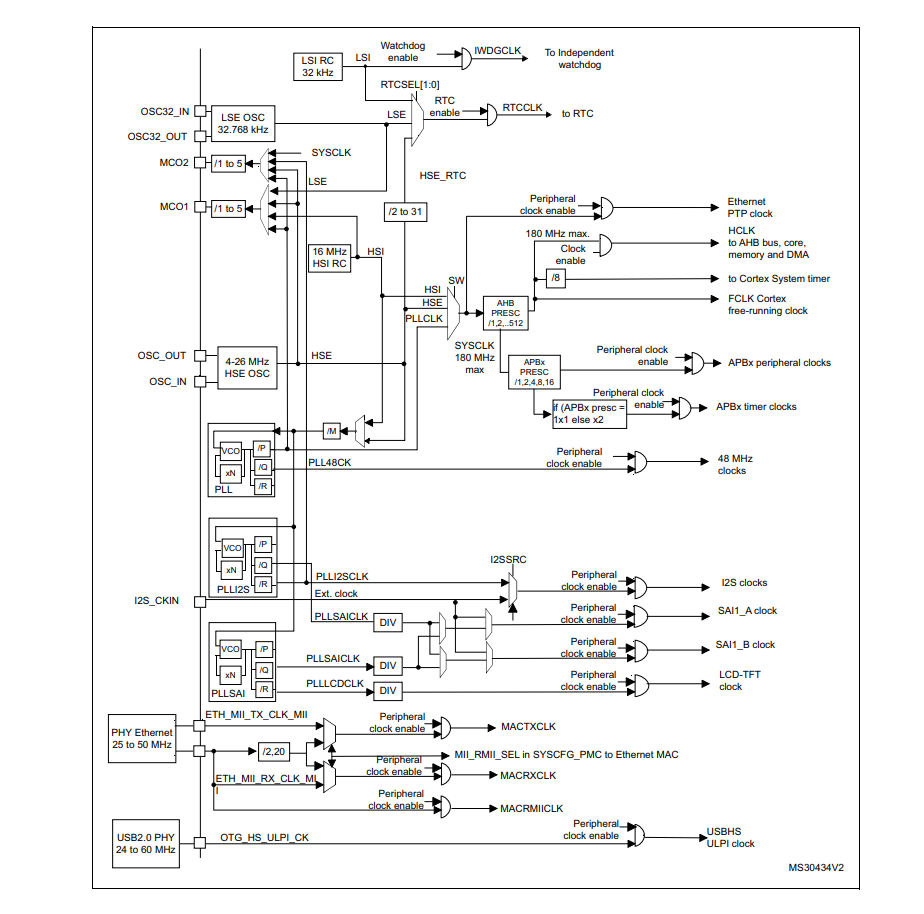
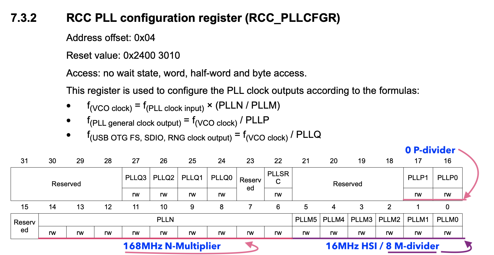
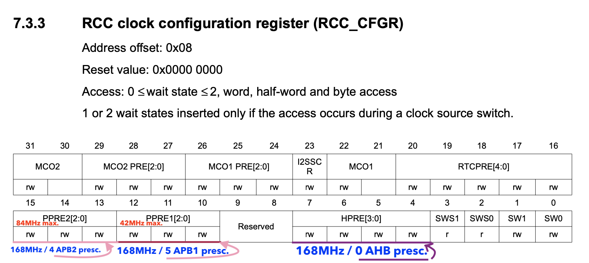
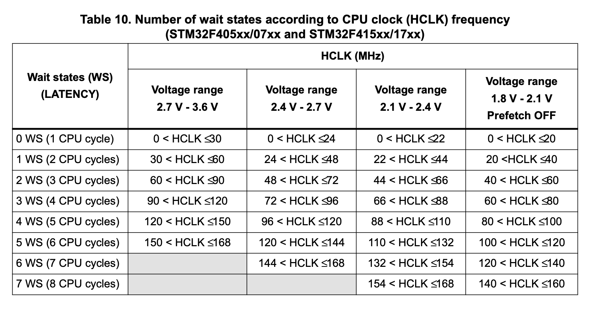
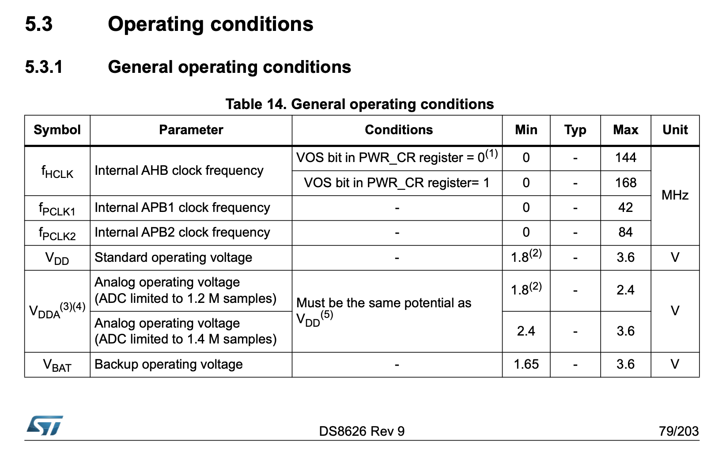
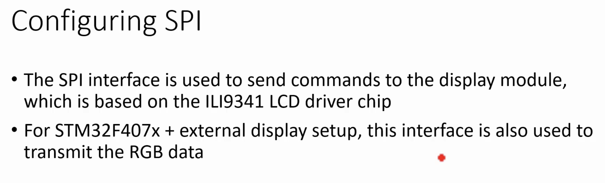

## Displaying VIBGYOR bars on the display
      
			
> Connection details of **ILI9341** chip with **STM32f407 discovery** as follows:    
      
			
			
       
			 
			 
		  
              
          
												
	       
     
		 
## Setup main system clock (Sysclk)		  
      
We will first configure SYSCLK for the maximum value a microcontroller can achieve for the display VIBGYOR bars exercise.     
        
	      
        
        
In the microcontroller STM32F429IDISCOVERY board, the maximum value for the SYSCLK could be 180MHz. That is the maximum speed of the SYSCLK.  And for this STM32F746GDISCOVERY microcontroller, it could be 216MHz, and for the STM32F407DISCOVERY board, it could be 168MHz.			
                
								
## Main PLL configuration								
           
To configure clock for maximum value we must use PLL engine to configure the system clock   
     
- PLL_M(Controls input to the PLL VCO and PLLSAI VCO) 
- PLL_N(Multiplier)
- PLL_P(Divider) 		 					 
        
	      
       
			  				
Above Clock tree diagram is nearly same for all the microcontrollers from ST. HSI, HSE and PLLCLK is the main part of the clock tree. We can select the SYSCLK out of HSI (16 Mhz for STM32F07 discovery board), HSE (8 MHz) or PLLCLK (168 Mhz) using the SW bit   
        
				
PLL stands for Phased Locked Loop (PLL). And this contains a block called VCO (Voltage Controlled Oscillator), which produces high-speed clocks. 	 
         
				 
	    
         
				  
					
	 									 
       
			 
## Program Flash wait state			 
          
			
            
						
						
						
## PWR settings      
        
				
       
			 
			 
				 
			 
			 								 			
        						
				