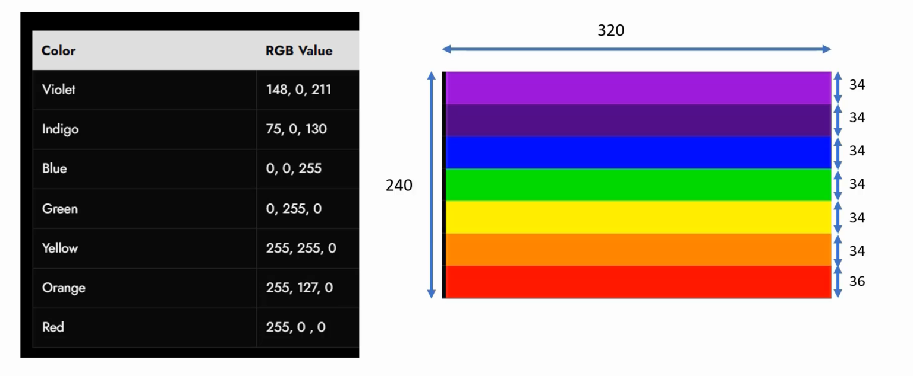
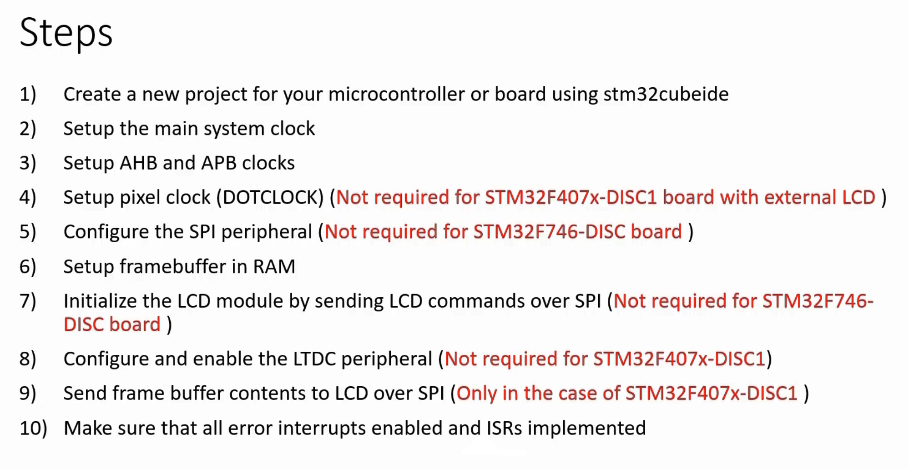

## Displaying VIGBYOR bars on the display
      
			
You can find the connection details of **ILI9341** chip with **STM32f407 discovery** in the demo project [01_demo_stm32f407discovery](https://github.com/noargs/ARM-cortex-m4-stm32-ltdc-lcd-tft-lvgl/tree/main/01_demo_stm32f407discovery)
           
					 
		  
              
							
							

          
												
	       
