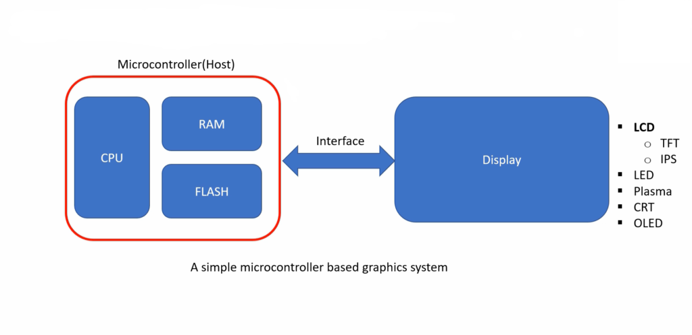
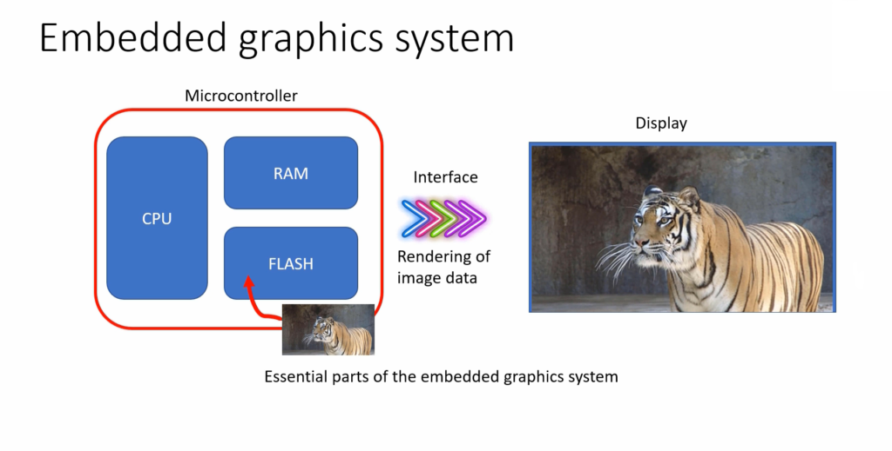
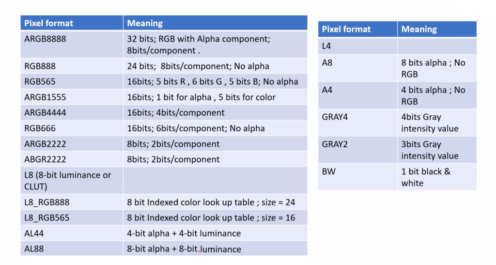
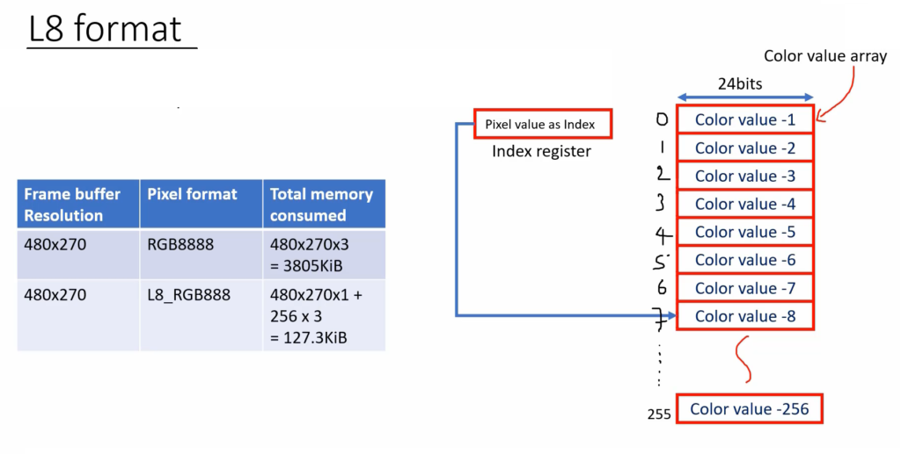
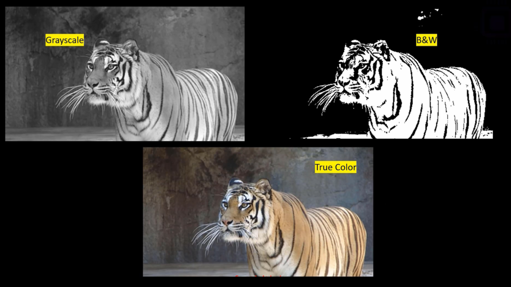
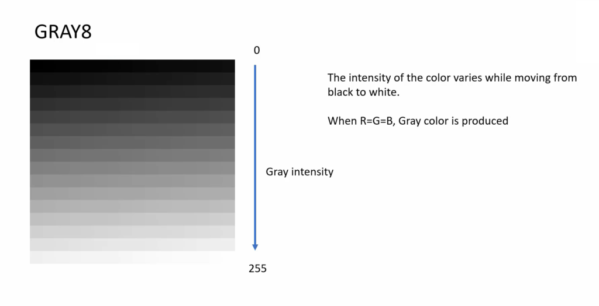

## ARM Cortex M4 stm32 LTDC LCD-TFT LVGL
      
			
Embedded graphic system, Interfacing over SPI, and building graphical UI using LVGL    
    
		 
       
- The display and the microcontroller board are connected with some interface.			 
      
- There are different interface techniques like parallel interfacing, serial interfacing, etc    
     
- There are several display modules available, based on the technology used to lit the pixels of the display, in the market (i.e. LCD, LED, Plasma, OLED displays etc.) 		 	
      
- In LCD itself there are various variants like TFT, IPS, etc    
       
- A display module (LCD) has its own circuitry based on some Controller (Display driver chip)   
            
- And that Display driver Chip interprets the signal, coming over this interface from Host (MCU), and controls the pixels of the display to show different colors or information which is being sent from the host.						  
      
- To show an image on the Display module, you have to convert that image into a stream of bytes and store it somewhere in the microcontroller’s memory (i.e. Flash memory or RAM). 
      
-	And finally stream those bytes over the microcontroller interface to the Display module. And Display driver chip of Display module interprets the signals and it controls the pixels of the display to show that information on the Display. 		
         
				 
				   
					  
### Important parts of the Embedded graphics system		  
         
				 
**Microcontroller (Host)**      
        
- Processor (Executes your code, updates frame buffer)    
     
- RAM (Frame buffer)         
      
- Flash (static images, fonts, texts, etc)				
           
					  
**Display Module**						
						
- Glass(where you see the graphics)       
      
- Driver chip (Interprets the signals sent by the host, generates required electric signals and voltages to lit the pixels of the display panel)						
						
						
> **Frame buffer**: A memory area which holds the pixel values of the frame to be updated on the display.    						
						
**Display controller (LCD controller)**								
			
- This is present at the Host (MCU). It generates display timing signals and transmits the pixel data over the interface						
						
- In MCU, There is a peripheral called LTDC (LCD-TFT Display Controller). It is also a bus master. It can directly take the pixel data from the Frame buffer and send it to the Display module over the LTDC interface. _No processor intervention is required_     
      
**External memories**		 									
						
- External Flash(your code + graphics components(images, texts) may not fit inside the internal flash)						
				
- And sometimes you may need two Frame buffers, in that case, the internal RAM may not be sufficient.						
						
						
**Graphics library (LVGL, TouchGFX)**								
		
- You may use already available graphic stack or libraries in your application, like LVGL, Touch graphics, or TouchGFX						
							
- Also called graphics middlewares, which will be helpful when building complex interactive graphics application.    
       
			 
**DMA**								
				
- Helps to transfer Frame buffer to display without the intervention of the CPU					 								 		

- To transfer graphic details from flash to Frame buffer without the intervention of the CPU			      
			 			 					
											
											
											
											
### Pixel formats (colour formats)											
           
The different pixel formats are shown below		
        
	
              
							
							
**ARGB8888**	
     
ARGB8888 is a color encoding system that is commonly used in computer graphics and digital imaging. If an image is represented in ARGB8888 pixel format, that means each pixel of that image consumes 32 bits (32bpp) in memory, and each pixel has 4 components.  
      
				
1. Alpha(opacity) component of 8bits   
2. Red color component of 8bits					 									 
3. Green color component of 8bits					 
4. Blue color component of 8bits   
       
Each component can take on values between 0 and 255, representing the intensity of that color channel. The alpha channel ranges from 0 (fully transparent) to 255 (fully opaque). When combined, these four components can create over 16 million different color variations.     
     
For example, the opacity is set to 255, the red component to 255, the green component to 0, and the blue component to 0.     
     
This results in the hex format `0xFFFF0000`, with `A` representing opacity, `R` representing red, `G` representing green, and `B` representing blue.		
       
			 
> **ARGB8888** means there are three color components and one opacity component, each of which is 8 bits. commonly used in graphics applications, such as video games and image editors, where precise control over colors and transparency is important. It is also used as a color format for storing and transmitting images and videos over the internet.     
        
				
				
**RGB888**		 
         
RGB888 is a color encoding system that represents colors using a combination of red, green, and blue components, each of which has 8 bits of information. This means that there are 256 possible values for each component, resulting in a total of 16,777,216 possible color combinations.         
      
There is no opacity level. That means the pixel doesn’t contain the opacity component or the alpha component.        
This consumes only 3 bytes. You can save 1 byte here for every pixel.   
     
If you have very limited memory in your microcontroller, then you should think about selecting the appropriate pixel format. You cannot randomly select any pixel format. 
     
		 
> **RGB888** sometimes referred as a 24-bit color because the total number of bits used to represent a single color is 24 (8 bits for red, 8 bits for green, and 8 bits for blue). This encoding system is commonly used in digital imaging and computer graphics and is supported by many display devices and software applications.		
      
			
			
**RGB565**		 
     
For most of the microcontroller-based Embedded graphics applications, RGB565 would suffice.      
       
RGB565 is a color encoding format that represents colors using 16 bits. It is often used in computer graphics, video games, and mobile devices.

The **RGB** in RGB565 stands for **Red Green Blue**, and the **565** refers to the number of bits assigned to each color channel. Specifically, the format allocates 5 bits for red, 6 bits for green, and 5 bits for blue.  
     
Because the green channel has an extra bit compared to red and blue, it can represent a wider range of colors than those two channels. However, the color accuracy of RGB565 is not as high as other formats that use more bits per channel, such as RGB888 or ARGB8888.		 
      
			
			
**L8 Formats**		 
     
It represents the colors of the image by a Color Lookup Table (CLUT). In L8 format, 8-bit index value is used to look for the color value in the predefined color lookup table.      
       
Your application will have one predefined color lookup table, which you can also call a color value array.  
     
Here you can see that there is one array of 24 bits and each array element stores one color value.    		
       
			 	 
			      
         
				 
Let’s say your application demands only 50 different colors, then you can just create an array of 50 elements (each element is of 3 bytes or  4 bytes), and you can store the corresponding color values.       
           
There will be one index register. When you load the index value to that index register, the corresponding color value will be fetched and it will be sent to the display module. If you use this method, then you can significantly reduce the memory consumption of the frame buffer.
      
			
			
**Grayscale and BW pixel format**		 
      
There is also another pixel format just for the grayscale images and for the black and white images.     
       
BW pixel format just means that there will be only one bit for the color component. The black and white image is shown in Figure 4.  There are only two colors: black and white. That’s why you just need only one bit to represent the color.			
       
			 	 
	  
        
				
But the grayscale is different. The grayscale or a gray color means, when R=G=B, the Gray color is produced.          
That’s why, if you consider GRAY8, that means, there is one byte to represent the Gray intensity. By using such pixel format, you can represent an image in grayscale format. The intensity of the color varies while moving from black to white. So, you just need  1 byte here. 				
       
			 	 
	  
        
If 1 byte = 0, then that means black. If 1 byte = 255, then it is fully white. And any in-between value will produce a Gray color with different intensity.       
        
So, if your application just wants to show the image as a grayscale image, then you can get rid of all these memory-consuming pixel formats you can just go for  GRAY4 or GRAY2, or GRAY8.        
        
That would save a lot of memory, but there will not be any color. So, there is only gray color with varying intensity.        
        
In the following article, we will understand some more terminologies like PPI, Resolution, etc.		   		      
         
				      

**Comparison of different formats**	  
      
Let’s compare. Let’s say your frame buffer resolution is 480×270. So, if you consider the pixel format RGB888, then the total memory consumed is 480x270x3. So, this gives you a number of pixels and each pixel consumes 3 bytes. 3805KiB is the total memory consumed.      
        
But, RGB888 pixel format gives you 2 to the power 24 different color variations. But sometimes that many color variations are not required for an application. You just need 50 color variations or 256 color variations, which means 256 different colors.    
       
In that case, you can use the L8_RGB888 format. So, in this case, there will be an array of 256 elements and each element consumes three bytes. And your frame buffer will hold a 1-byte index value.      
      
The pixel value is nothing but it’s an index value. It’s just a 1-byte index value. That’s how you can significantly reduce the memory consumption of the frame buffer. At the same time, you can have your desired colors for the application.       
         
Actually, the STM32 microcontroller supports such pixel formats.  In hardware itself, you can create such an array and it provides you the index register and everything works at the hardware level.			

   							 					 
   		 			 					 
					 
					 
					 
					 
					 
					 
					 
					 
					 
					 
					 
					 
					 
					 
					 
					 
					 
					 
					 
					 
					 
					 
					 
					 
					 
					 
					 
					 
					 
					 
					 